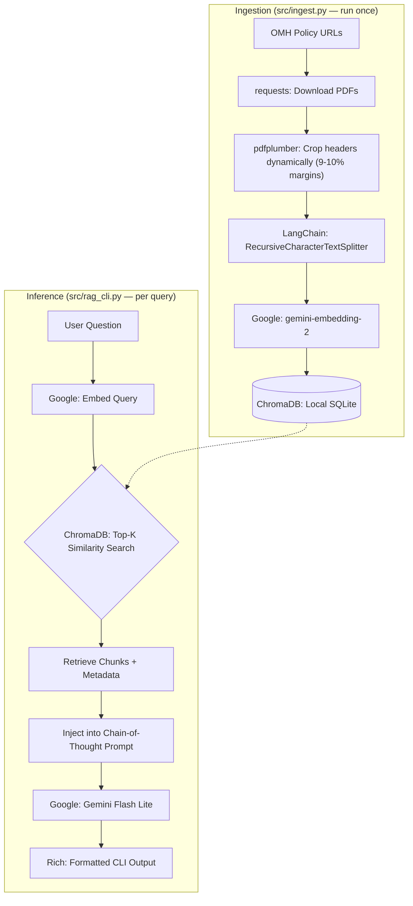

# Low-Level Design (LLD): OMH Policy RAG Application

## 1. System Overview & Design

The NYS Office of Mental Health (OMH) Policy RAG Application is a locally executable Retrieval-Augmented Generation pipeline. It is designed to answer questions based on OMH policy manuals accurately, with inline source citations.

To mirror production ETL workflows, the system is strictly decoupled into two phases:
*   **Ingestion Phase (`src/ingest.py`)**: A one-time, expensive document processing pipeline that downloads, cleans, chunks, and embeds PDFs into a vector database.
*   **Inference Phase (`src/rag_cli.py`)**: A lightweight, real-time querying engine that retrieves relevant chunks and generates answers.

## 2. Tools & Why We Chose Them

*   **Google Gemini 3.1 Flash Lite**: Chosen as the LLM and embedding provider because it allows reviewers to run the code immediately without complex local GPU setups, while still being extremely fast and cost-effective.
*   **ChromaDB**: Selected for vector storage because it saves directly to a local SQLite folder (`.chroma_db/`). This completely avoids the need for Docker containers, external database hosting, or additional API keys.
*   **LangChain**: Used as the orchestration framework for its `RecursiveCharacterTextSplitter` and standardized interfaces (`VectorStore`, `BaseChatModel`), which make it easy to swap models or databases in the future (Zero Vendor Lock-in).
*   **pdfplumber**: Chosen over standard PyPDF because it allows for precise, coordinate-based cropping of PDF pages, which is essential for our data cleaning strategy.
*   **Rich**: Used to build a clean, readable CLI interface with formatted panels and color-coded status outputs, improving the developer and user experience.

## 3. Data Ingestion & PDF Cleaning

The dataset consists of highly structured administrative PDFs. The primary threat to our RAG pipeline's accuracy was **header pollution**. Administrative headers (e.g., *"Page X of Y"*) split sentences and disrupt semantic meaning when naive chunking is applied.

**How PDFs were cleaned:**
Instead of regex-based text removal (which is error-prone), we used `pdfplumber` to map a bounding box tailored to each PDF. By cropping the top margin (9% for PC-522, and 10% for the rest) and keeping a 0% bottom crop, we achieved a **100% loss-less extraction**. This physically deleted the administrative headers before text extraction without clipping a single letter of actual policy text.

**Chunking Strategy:**
Cleaned text is passed to LangChain's `RecursiveCharacterTextSplitter` with a 1,000-character chunk size and 200-character overlap. This size preserves natural boundaries like full paragraphs and rules. Retrieving the top 5 chunks (`k=5`) gives the LLM ~5,000 characters of context—enough to synthesize cross-page rules without diluting the prompt.

## 4. Challenges & What Broke

During development, several issues broke the pipeline or degraded performance, requiring specific mitigations:

*   **Duplicate Vector Embeddings:** Initially, re-running `ingest.py` would append duplicate chunks to ChromaDB, ruining search results. *Fix:* Implemented a "Wipe and Rebuild" state management pattern that safely deletes the existing local database folder before starting ingestion.
*   **API Rate Limiting:** The evaluation script (`evaluate.py`) triggered Google Gemini's free-tier API rate limits ("429 Too Many Requests") because it fired LLM calls in a tight loop. *Fix:* Added a forced 15-second `time.sleep()` between evaluation cases to respect limits.
*   **LLM Hallucinations on Out-of-Scope Queries:** When asked about unrelated topics (e.g., "capital of France"), the model would sometimes try to answer based on its pre-training rather than the retrieved policy text. *Fix:* Engineered a strict Chain-of-Thought system prompt forcing the model to explicitly verify if the context contains the answer and output an exact refusal string if it doesn't.

*   **API Cost Constraints & Provider Migration:** Development initially began using OpenAI models. However, I quickly realized I lacked the API credits/funds on that account and had to pivot the entire pipeline to Google Gemini's free tier. *Fix:* Because I had designed the system using LangChain's abstract interfaces (`BaseChatModel` and `Embeddings`) and Dependency Injection, this migration required zero rewrites to the core `InferenceEngine`. It proved the architecture is highly resilient and future-proofed for swapping LLM vendors instantly.

## 5. Future Improvements (What to do with more time)

If given more time to transition this MVP into an enterprise-grade production system, I would implement the following:

*   **Cosine Similarity Thresholds:** Currently, the system blindly retrieves the Top-5 chunks (`k=5`). For completely unrelated queries, this returns the 5 "least bad" chunks. I would add a strict confidence score threshold; if the top chunk falls below it, the system short-circuits and refuses to answer, saving token costs and reducing hallucination risks.
*   **Query Rewriting & Session Memory:** The current CLI is stateless and single-turn. To support conversational Q&A, I would add a rolling buffer memory and a lightweight LLM pre-processing step that rewrites conversational history into a standalone, optimized search query before hitting ChromaDB.
*   **Private LLM Hosting:** For strict HIPAA/OMH compliance with Protected Health Information (PHI), the backend would be swapped from Google Gemini to a privately hosted Azure OpenAI instance or a local Llama-3 model. Because the `InferenceEngine` uses dependency injection, this requires zero changes to the core logic.
